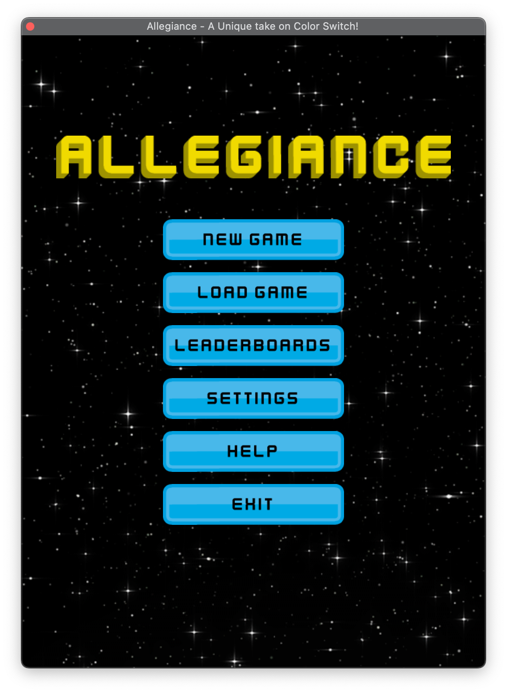

# Allegiance - A JavaFX Color Switch Clone!

## Overview

The game is a clone of the famous Color Switch game available on iOS and Android. Instead of the original game graphics though, we decided to theme the game based on
classic space shooter games. We have a ship in place of the ball and several other objects as obstacles in the game. The ship can change color by picking up the color switcher
power ups as we progress through the game and a ship can only pass through an obstacle if both the obstacle and the ship are of the same color, otherwise the ship crashes into the obstacle.
 
 
The player also collects stars in the game which count towards the player's score and also help revive the ship in case the ship is destroyed.

 
 

